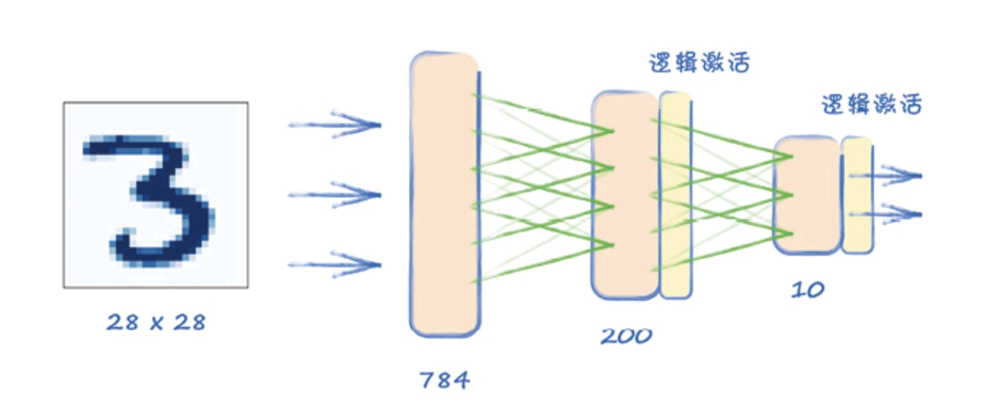

# 基于BP三层全连接神经网络的MNIST手写数字识别
## 1.前言：

代码采用Python语言，建议vscode或jupyter notebook打开源代码。借助的是PyTorch库。

MNIST训练数据下载地址：https://pjreddie.com/media/files/mnist_train.csv 

MNIST测试数据下载地址：https://pjreddie.com/media/files/mnist_test.csv

关于pytorch库的简单介绍：

PyTorch 是一种用于构建深度学习模型的功能完备框架，是一种通常用于图像识别和语言处理等应用程序的机器学习。使用 Python 编写，因此对于大多数机器学习开发者而言，学习和使用起来相对简单。PyTorch使用一种独特的变量存储数字，称其为PyTorch张量。PyTorch还具有自动求导机制（基于链式求导法则），而关联张量和自动微分的能力是PyTorch最重要的特性，几乎所有的其他功能都基于这一特性。

MNIST图像数据集：

MNIST数据集是一组常见的图像，常用于测评和比较机器学习算法的性能。其中6万幅图像用于训练机器学习模型，另外1万幅用于测试模型。这些图像大小为28×28像素的单色，每个像素是一个0-255的数值，表示该像素的明暗度。

Pandas库介绍：

pandas是一个强大的分析结构化数据的工具集；它的使用基础是Numpy（提供高性能的矩阵运算），可用于数据挖掘和数据分析，同时也提供数据清洗功能。

## 2.实现细节：

由于MNIST数据集图像的像素个数为784，意味着神经网络的输入层必须有784个节点，隐藏层节点个数设置为200个，最后的输出层需要回答“这是什么数字？”，也就是需要10个节点表征0~9。网络中任何一层的所有节点，都会连接到下一层中的所有节点，故称为全连接层。

我们首先定义神经网络类：

torch.nn.Module是所有网络的基类，因此我们的模型也应该继承此类。在我们的神经网络类的\__init\_\_()函数中，要先用super.__init\_\_()继承父类的方法，然后使用nn.Sequential( )定义神经网络层，在里面依次加入全连接层、激活函数、标准化、输出层、激活函数，如下图所示：

其中，输入层之后的激活函数使用的是LeakyReLU激活函数，输入0.02用于控制负半轴的斜率。它是一种专门设计用于解决Dead ReLU问题的激活函数：
$$
LeakyReLU(x)=\begin{cases}
x,x>0 \\
\alpha x,x\leq0
\end{cases}
$$
Leaky ReLU函数的特点：

- Leaky ReLU函数通过把x xx的非常小的线性分量给予负输入0.01 x 0.01x0.01x来调整负值的零梯度问题。

- Leaky有助于扩大ReLU函数的范围，通常α 的值为0.01左右。
- Leaky ReLU的函数范围是负无穷到正无穷。

输出层之后的激活函数使用的是Sigmoid函数，这是一个在生物学中常见的S型函数，也称为S型生长曲线。在深度学习中，由于其单增以及反函数单增等性质，Sigmoid函数常被用作神经网络的激活函数，将变量映射到 [0, 1] 之间。
$$
S(x)=\frac{1}{1+e^{-x}}
$$
为什么不一致使用LeakyReLU激活函数呢？

这是因为Sigmoid函数的主要缺点是输入值变大时，梯度会变得非常小甚至消失，意味着无法通过梯度更新链接权重，会导致模型收敛时间过长。由于后面我们使用的误差方法是nn.BCELoss()，BCE只能处理0~1的值，而LeakyReLU有可能输出范围之外的值，所以应该在最终层之后保留一个S型函数，但在隐藏层之后使用LeakyReLU()。

上图中还有一个nn.LayerNorm类，用于将输入层的tensor标准化，作用是把神经元在经过非线性函数映射后，输出值区间强行拉回到均值为 0 方差为 1 的正态分布的区间，使得非线性变换函数的输入值落入激活函数比较敏感的区域，这样会让让梯度变大，由此避免了梯度消失的问题。而梯度变大也意味着学习收敛速度快，能大大加快训练速度。

随后，我们需要定义误差，使用的是二元交叉熵损失：
$$
BCELoss=-\frac{1}{n}\sum_{i=1}^n{[y_i\cdot logp(y_i=1)+(1-y_i)\cdot log(1-p(y_i=1))]}
$$
二元交叉熵损失的特性是：当预测值接近标签值时损失很小，当预测值远离标签值时损失很大，这一特性有利于模型的学习。

紧接着，定义更新权重的方法。SGD ( stochastic gradient descent ) 是随机梯度下降法，缺点之一是会使损失函数陷入局部最优，另一个缺点是它对所有的可学习参数都使用单一的学习率。

因此我们使用Adam优化器，它结合AdaGrad和RMSProp两种优化算法的优点，对于每个可学习参数可以有单独的学习率。

至此，\_\_init\_\_( )函数构造完毕，之后我们需要构造训练函数：

通过train( )函数计算网络的输出以及误差，再用误差进行反向传播更新链接权重。

self.optimiser.zero_grad( )用于梯度置零，即把误差关于权重的导数重置为0，在每一轮批处理前进行此操作的原因是：根据pytorch中的backward()函数的计算，当网络参量进行反馈时，梯度是被积累的而不是被替换掉，但是在每一批处理时，并不需要将两个batch的梯度混合起来累积，因此这里就需要每次开始前置零梯度。

误差反向传播后，各个链接权重的梯度被更新，之后optimizer.step( )利用之前定义的优化器对各个链接权重的值进行更新。

除了神经网络的类外，还构建了一个继承torch.utils.data.Dataset类的MnistDataset类，实例化后，对其传入文件路径即可加载和使用数据。

## 3.训练

对MnistDataset类进行实例化，传入MNIST训练数据集的文件路径，再对神经网络实例化。

训练后的损失图如下图所示：

从图中可看出损失值迅速降至0左右，均值始终保持得较低，但损失值噪声较多。

## 4.测试

现在利用MNIST测试数据集对神经网络模型进行测试：

训练后，可以看到输出显示的数字，9724表示识别成功的样本数，10000表示总样本数，识别率为97.24%
